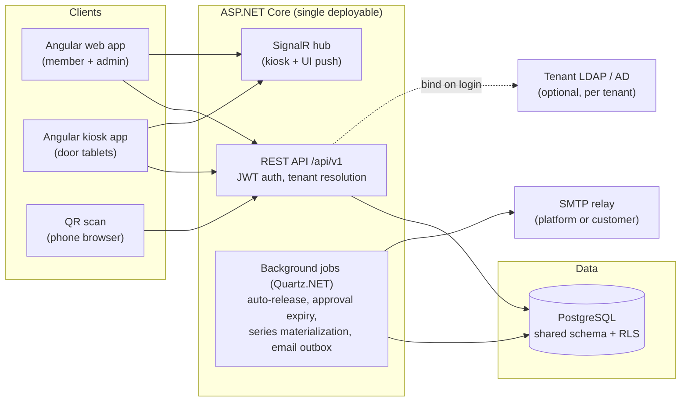
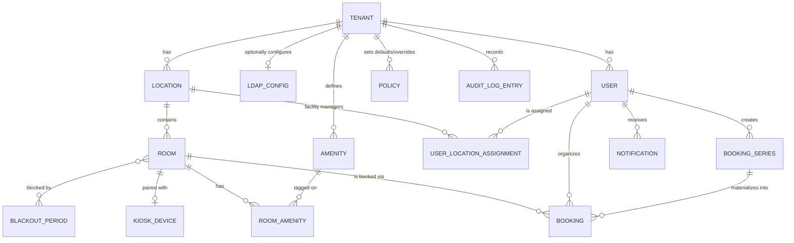
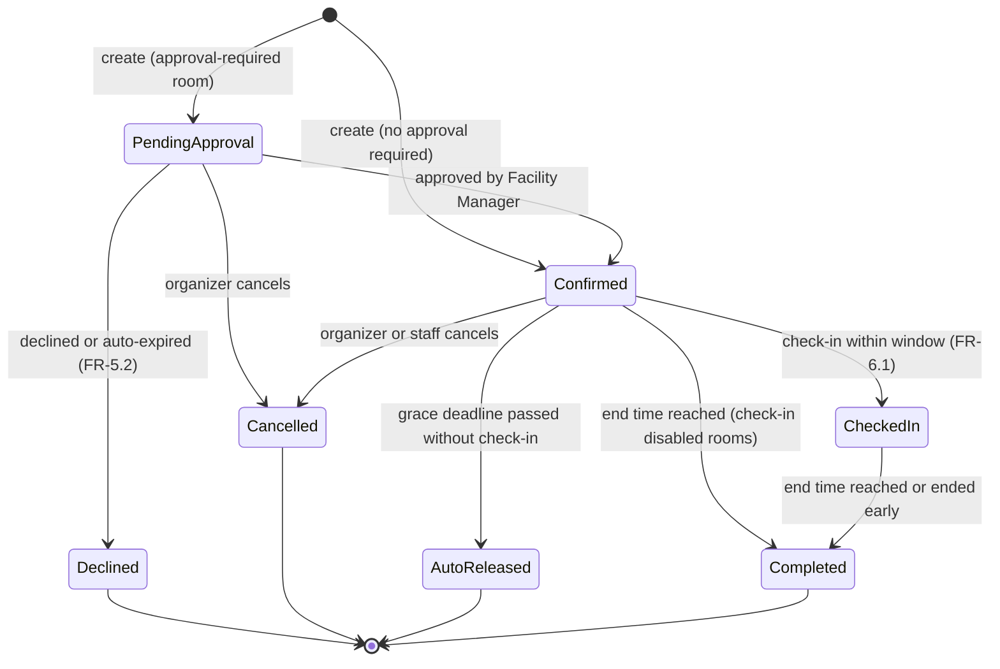

# Roomy — Technical Design

| | |
|---|---|
| **Status** | Draft |
| **Last updated** | 2026-06-10 |
| **Companion doc** | [Product Requirements](./product-requirements.md) |

This document describes how to build the system specified in the PRD. Requirement references (`FR-x.y`, `G-x`) point there.

## 1. Architecture overview

A deliberately boring architecture: one deployable ASP.NET Core service (API + SignalR + background jobs), one PostgreSQL database, Angular clients. At the target scale (≤100 tenants, ~50k users, ~10 bookings/sec peak) a modular monolith is the right call — no message broker, no microservices, no cache tier in v1. The service is stateless (jobs coordinate through the database), so the cloud deployment can still run 2+ replicas for availability.



## 2. Stack

| Layer | Choice | Notes |
|---|---|---|
| Frontend | **Angular** (latest LTS), Nx-style monorepo workspace | Three apps — `member`, `admin`, `kiosk` — sharing libraries (`api-client`, `ui`, `auth`). Angular Material as the component base. API client generated from OpenAPI. |
| API | **ASP.NET Core** (.NET LTS), minimal APIs or MVC controllers | Single project with feature folders (vertical slices): `Tenants`, `Identity`, `Rooms`, `Bookings`, `Policies`, `CheckIn`, `Kiosks`, `Notifications`, `Reports`. |
| ORM | **EF Core** + Npgsql | Migrations via `dotnet ef`; raw SQL where EF fights us (availability queries, reports). |
| Database | **PostgreSQL 16+** | Shared schema, RLS, `btree_gist` exclusion constraint (§6.1). |
| Realtime | **SignalR** | Kiosk/UI push (FR-7.4). Postgres `LISTEN/NOTIFY` as the backplane between replicas (sufficient at this scale; swappable for Redis later). |
| Jobs | **Quartz.NET** (Postgres job store, clustered) | Ensures singleton execution of scheduled jobs across replicas. |
| Auth | ASP.NET Core Identity (local accounts) + custom LDAP provider | §7. |
| Email | MailKit over SMTP | Outbox pattern (§9). |
| Packaging | Docker images; Docker Compose (self-host baseline) + Helm chart | §10. |

**Why this shape:** the team has chosen Angular/.NET/PostgreSQL; everything else above is the lowest-operations option satisfying the NFRs, with self-host parity (PRD §7) ruling out cloud-only managed services in the core path.

## 3. Tenant resolution

Every request is bound to exactly one tenant before it touches data:

1. **Cloud:** subdomain (`acme.roomy.app`) → tenant slug. **Self-hosted:** path prefix (`/t/acme/...`) or a single-tenant default configured at install.
2. The JWT carries `tenant_id` (and `device_id` for kiosks). Middleware verifies that the token's tenant matches the resolved tenant; mismatch → 401.
3. Middleware stores `tenant_id` in an `ITenantContext` (scoped service) used by EF Core filters and the RLS GUC (§4).
4. Platform Operator endpoints live under `/api/v1/platform/*`, require the operator role, and are the only routes that run without a tenant context — they can manage tenant records but have no routes that read tenant business data (PRD §3).

## 4. Tenant isolation (defense in depth)

Three independent layers must agree before data flows (US-7):

1. **Application:** every EF Core entity (except `tenants` and platform tables) has a `TenantId` column and a global query filter `e.TenantId == _tenantContext.TenantId`. A `SaveChanges` interceptor stamps `TenantId` on inserts and rejects cross-tenant writes.
2. **Database (RLS):** the app connects as a non-superuser role without `BYPASSRLS`. On opening a connection/transaction, an Npgsql interceptor runs `SET LOCAL app.tenant_id = '<guid>'`. Every tenant-owned table has:

   ```sql
   ALTER TABLE bookings ENABLE ROW LEVEL SECURITY;
   ALTER TABLE bookings FORCE ROW LEVEL SECURITY;
   CREATE POLICY tenant_isolation ON bookings
       USING (tenant_id = current_setting('app.tenant_id')::uuid);
   ```

   If the GUC is unset, `current_setting` errors and the query fails closed. Background jobs iterate tenants and set the GUC per tenant; a separate `maintenance` role with `BYPASSRLS` exists only for migrations and operator tooling.
3. **API:** route IDs that resolve to nothing (including rows hidden by RLS) return **404**, never 403, so existence is not disclosed.

**CI enforcement:** an integration test suite seeds two tenants and asserts every endpoint returns 404/empty for cross-tenant IDs; a schema test asserts every table (allowlist excepted) has RLS enabled and a tenant policy — so a new table cannot ship without isolation.

## 5. Data model



Conventions: PKs are `uuid` (v7 for index locality); all timestamps `timestamptz` (UTC); soft state via status columns, no soft-delete except users (deactivated). Every tenant-owned table: `tenant_id uuid not null` + composite indexes leading with `tenant_id`.

Key tables (abridged; full DDL lives in migrations):

| Table | Notable columns |
|---|---|
| `tenants` | `slug` (unique), `name`, `status` (active/suspended), `settings jsonb` (grace period, title privacy, walk-up flag, series horizon) |
| `users` | `email` (unique per tenant), `password_hash` (null for LDAP-only), `role` (enum: tenant_admin / facility_manager / member), `auth_source` (local/ldap), `ldap_dn`, `status`, `no_show_count`, `pin_hash` (kiosk PIN, FR-7.3) |
| `ldap_configs` | host, port, security mode, `bind_dn`, `bind_password_enc` (encrypted, §11), base DN, user filter, attribute map `jsonb`, group→role map `jsonb`, enabled |
| `locations` | name, address, `timezone` (IANA), `business_hours jsonb` |
| `rooms` | `location_id`, name, capacity, floor, status, `requires_approval`, `checkin_required`, `qr_token` (regenerable, FR-2.4), photo ref |
| `policies` | `scope` (tenant/location/room) + scope id, `key` (booking_window_days / max_duration_min / min_duration_min / quota_active / enforce_business_hours), `value jsonb`. Resolution: room → location → tenant → hardcoded default |
| `booking_series` | room, organizer, title, `rrule` (RFC 5545 subset: FREQ/BYDAY/BYMONTHDAY/BYSETPOS/UNTIL/COUNT), `local_start_time`, `local_end_time`, `timezone` (copied from location at creation), `until`, status |
| `bookings` | room, organizer, `series_id` (null = one-off), `is_exception`, title, `start_at`/`end_at` (timestamptz), `period tstzrange` generated column, `status` (enum per §6.3), `attendee_count`, `checked_in_at`, `decided_by`/`decided_at`/`decline_reason`, `cancel_reason` |
| `blackout_periods` | scope (location or room set via join table), `period tstzrange`, reason |
| `kiosk_devices` | `room_id` (unique), name, `token_hash`, `last_seen_at`, `app_version`, status |
| `notifications` | user, category, payload `jsonb`, `read_at` |
| `outbox_emails` | recipient, template, payload, `status`, `attempts`, `next_attempt_at` |
| `audit_log` | actor, action, entity type/id, `before/after jsonb`, timestamp |

## 6. Booking engine

### 6.1 No double-booking (FR-4.3, G2)

The invariant is enforced by the database, not by application checks:

```sql
CREATE EXTENSION IF NOT EXISTS btree_gist;

ALTER TABLE bookings ADD CONSTRAINT no_overlap
    EXCLUDE USING gist (room_id WITH =, period WITH &&)
    WHERE (status IN ('pending_approval', 'confirmed', 'checked_in'));
```

Booking creation flow: validate policies (FR-5.3/5.5) → insert → on `23P01` exclusion violation, map to HTTP 409 with alternative suggestions (FR-4.6). Two racing inserts cannot both commit; no advisory locks or serializable isolation needed. The application still pre-checks availability for good UX, but correctness never depends on the pre-check. Blackouts are checked in the same transaction against `blackout_periods` (`period && range` under `FOR SHARE` on the blackout rows, so a concurrent blackout creation and booking can't interleave).

### 6.2 Recurrence (FR-4.7–4.11)

**Materialized occurrences:** a `booking_series` row stores the rule; each occurrence is a real `bookings` row. This makes the exclusion constraint, availability queries, check-in, and reporting uniform — one-off and recurring bookings are the same thing at query time. With a 6-month horizon and 15-min snapping, worst-case rows per series (~180 daily occurrences) are trivial.

- **DST (FR-4.10):** the series stores *local wall-clock time + IANA zone*; occurrence UTC instants are computed per date with NodaTime (`ZonedDateTime` resolution, post-transition mapping for skipped/ambiguous times). Never "first occurrence + N×7 days" arithmetic.
- **Creation:** expand the rule, attempt all inserts in one transaction with per-row conflict capture (insert each occurrence in a savepoint; on exclusion violation, record the date and continue), report conflicting dates, and commit only after the user chooses "book conflict-free" (FR-4.8) — implemented as a two-step API: `POST /bookings/series/preview` (dry-run, no commit) then `POST /bookings/series` with `skipDates`.
- **Edits:** "this occurrence" sets `is_exception = true` and edits the row; "this and following" sets the series `until` and creates a new series for the tail. Series-level approval (FR-4.11) decides all occurrences in one action.
- **Horizon:** v1 requires an end (`UNTIL`/`COUNT` ≤ 6 months), so no rolling materialization job is needed; the schema (`rrule`, nightly Quartz hook) leaves room for "never-ending" series later.

### 6.3 State machine (normative for FR-4.2)



Transitions are guarded in one place (a `BookingStateMachine` domain service); every transition writes the audit log and raises an in-process domain event consumed by notifications (§9) and SignalR (§8.3).

### 6.4 Background jobs (Quartz.NET, clustered)

| Job | Schedule | Action |
|---|---|---|
| Auto-release | every 1 min | `Confirmed` bookings on check-in rooms past `start_at + grace` → `AutoReleased`; increment organizer `no_show_count`; notify; push to kiosk. |
| Approval expiry | every 5 min | `PendingApproval` past min(48 h, start) → `Declined` (FR-5.2). |
| Completion sweep | every 5 min | `CheckedIn`/`Confirmed` past `end_at` → `Completed`. |
| Email outbox | every 30 s | Send pending `outbox_emails` with retry/backoff (§9). |
| Retention | daily | Apply data-retention settings (PRD OQ-4). |

Jobs scan with `tenant_id`-leading partial indexes (e.g., on `(status, start_at)`), so each tick is a cheap indexed query.

## 7. Authentication & authorization

### 7.1 Local accounts (FR-1.4)

ASP.NET Core Identity with Argon2id password hashing, email verification, time-limited invite/reset tokens (72 h), lockout after configurable failures. Sessions are JWTs: 15-min access token (claims: `sub`, `tenant_id`, `role`, `auth_source`) + rotating refresh token in an HttpOnly Secure cookie, revocable server-side (per-user token family in DB).

### 7.2 LDAP (FR-1.5)

- Library: `System.DirectoryServices.Protocols` (cross-platform on .NET 5+); LDAPS or StartTLS only — plaintext binds are rejected at config validation.
- Login flow when the tenant has LDAP enabled: look up local user by email → if `auth_source = ldap` (or unknown user and JIT enabled): service-account bind → search by configured filter (`(mail={0})` default) → bind as the found DN with the user's password → on success, upsert the local user (name/email from attribute map, role from group map, default Member) and issue the normal JWT pair.
- Failure modes: directory unreachable → 503 with "directory unavailable" (US-6); local-source users (including the break-glass Tenant Admin) always authenticate locally regardless of LDAP state.
- Bind credentials encrypted at rest with the app's data-protection key ring (§11); "Test connection" endpoint performs bind + sample search without saving.

### 7.3 Kiosk devices (FR-7.1)

Pairing: device shows a code from `POST /kiosks/pairing-code` (anonymous, rate-limited, returns a short-lived code bound to the device's ephemeral key); a Facility Manager enters the code in admin and selects the room; the device exchanges the code for a long-lived **device token** (opaque, hashed at rest, scoped claims `device_id`, `room_id`, `tenant_id`). Device tokens authorize only: read own room's schedule, check-in/end for current booking, walk-up booking, heartbeat. Revocation (FR-7.6) deletes the hash — effective on next request and SignalR reconnect.

### 7.4 Authorization

Role checks as ASP.NET Core authorization policies; location scoping for Facility Managers enforced via `user_location_assignments` in resource handlers (e.g., `CanManageRoom`). Authorization failures on resource IDs return 404 (§4).

## 8. API design

### 8.1 Conventions

REST under `/api/v1`, OpenAPI 3 generated from code (Swashbuckle) and consumed by the Angular client generator. JSON camelCase; instants as ISO-8601 UTC; every response echoes the location time zone where relevant. Errors are RFC 7807 problem details with a stable `code` (e.g., `booking_conflict`, `policy_violation.max_duration`). Cursor pagination (`?cursor=&limit=`). Booking-creating endpoints accept an `Idempotency-Key` header (stored 24 h) so client retries can't double-book even logically.

### 8.2 Surface (representative)

| Area | Endpoints |
|---|---|
| Platform | `POST/GET/PATCH /platform/tenants`, `POST /platform/tenants/{id}/suspend` |
| Auth | `POST /auth/login`, `/auth/refresh`, `/auth/logout`, `/auth/forgot-password`, `/auth/invitations/{token}` |
| Users | `GET/POST /users`, `PATCH /users/{id}` (role/status), `GET /audit-log` |
| LDAP | `GET/PUT /settings/ldap`, `POST /settings/ldap/test` |
| Locations/rooms | CRUD `/locations`, `/locations/{id}/rooms`, `/amenities`; `POST /rooms/{id}/qr/regenerate` |
| Availability | `GET /availability?locationId=&date=&capacity=&amenities=&from=&to=` (grid + search, FR-3) |
| Bookings | `POST /bookings`, `GET /bookings/{id}`, `PATCH`, `POST /bookings/{id}/cancel`, `POST /bookings/series/preview`, `POST /bookings/series`, series occurrence/`this-and-following` edits |
| Approvals | `GET /approvals?status=pending`, `POST /bookings/{id}/approve|decline` |
| Check-in | `POST /bookings/{id}/check-in`, `POST /bookings/{id}/end`; `GET /rooms/by-qr/{qrToken}` (resolves QR → room + caller's eligible booking) |
| Kiosk | `POST /kiosks/pairing-code`, `POST /kiosks/claim`, `GET /kiosk/schedule`, `POST /kiosk/check-in`, `POST /kiosk/walk-up`, `POST /kiosk/heartbeat` |
| Policies | `GET/PUT /policies` (scoped), CRUD `/blackouts` (returns affected bookings before confirm, FR-5.4) |
| Reports | `GET /reports/utilization|no-shows|approvals` (+ `?format=csv`) |
| Notifications | `GET /notifications`, `POST /notifications/{id}/read` |

### 8.3 Realtime

SignalR hub with groups per room (`room:{id}`) and per user (`user:{id}`). Server pushes `bookingChanged` events on every state transition; kiosks subscribe to their room's group (satisfies FR-7.4's 5-second propagation), web clients to visible rooms. Kiosks also poll `GET /kiosk/schedule` every 60 s as fallback and cache the response for offline display (FR-7.5).

## 9. Notifications

Domain events → handlers write `notifications` rows (in-app) and `outbox_emails` rows **in the same transaction** as the state change (transactional outbox) → Quartz job sends via MailKit/SMTP with exponential backoff (5 attempts, then dead-lettered and surfaced in operator health). Templates are Razor-rendered with tenant branding (FR-8.3). SMTP settings: platform-level config in cloud; per-install config self-hosted; optional per-tenant override later.

## 10. Deployment & configuration

**Artifacts (one codebase, FR/G6):** `roomy-api` image (API + SignalR + Quartz) and `roomy-web` image (nginx serving the three built Angular apps; kiosk app at `/kiosk`).

- **Cloud SaaS:** Kubernetes, ≥2 API replicas, managed PostgreSQL, wildcard TLS for `*.roomy.app`. EF migrations run as a pre-deploy job (using the `maintenance` role, §4).
- **Self-hosted:** Docker Compose file (api, web, postgres, optional backup sidecar) as the baseline; Helm chart for customers on Kubernetes. All config via environment variables / mounted secrets: connection string, data-protection keys, base URL + tenancy mode (subdomain/path/single), SMTP, JWT signing key. A `roomy admin create-tenant` CLI (and the platform API) provisions tenants; single-tenant installs run it once.
- Versioned releases with migration compatibility guarantee N-1 → N; self-host upgrade = pull images, run migration command, restart.

## 11. Security

- TLS everywhere; HSTS; CSP on all three apps; CSRF not applicable to bearer-token API but refresh-cookie endpoint is SameSite=Strict + origin-checked.
- Secrets: LDAP bind passwords and SMTP credentials encrypted with ASP.NET Core Data Protection (key ring persisted to DB, master key from environment/KMS).
- Rate limiting (ASP.NET Core middleware): tight on `/auth/*`, kiosk pairing, and QR resolution endpoints.
- Input validation at the edge (FluentValidation); EF parameterization throughout; no string-built SQL.
- Audit log (FR-1.6) is append-only (no UPDATE/DELETE grants for the app role).
- Dependency and container scanning in CI; OWASP ASVS L2 checklist as the security review gate (PRD §7).

## 12. Observability & testing

- **Observability:** structured logs (Serilog, JSON) with `tenant_id`/`trace_id` enrichment; OpenTelemetry traces + metrics (booking conflict rate, auto-release count, job lag, LDAP login latency); `/healthz` (liveness) and `/readyz` (DB + Quartz scheduler) endpoints; self-hosted installs get the same endpoints for the customer's own monitoring.
- **Testing:** domain unit tests (state machine, policy resolution, recurrence/DST — golden tests across DST transitions in multiple zones); integration tests against real PostgreSQL via Testcontainers (exclusion constraint races, RLS, the cross-tenant suite from §4); API contract tests from the OpenAPI spec; Angular component tests + a Playwright e2e smoke (book → approve → check-in → auto-release); load test asserting the 10 bookings/sec and p95 NFRs before GA.

## 13. Risks and alternatives considered

| Decision | Alternative rejected | Why |
|---|---|---|
| Shared schema + RLS | Schema-per-tenant / DB-per-tenant | At ≤100 tenants, migration and connection-pool complexity outweighs isolation gains; RLS + CI tests give defense in depth. Revisit if a customer contractually requires physical isolation (escape hatch: dedicated self-hosted install). |
| Materialized occurrences | Virtual expansion of RRULEs at query time | Virtual expansion breaks the exclusion constraint and complicates every availability query; materialization is cheap at a 6-month horizon. |
| Exclusion constraint | App-level locking / serializable transactions | DB-enforced invariant survives bugs, scripts, and future services; the others are easy to get subtly wrong. |
| Quartz in-process | Separate worker service | One deployable keeps self-hosting simple; Quartz clustering already handles multi-replica. Split out only if job load ever interferes with API latency. |
| Postgres LISTEN/NOTIFY backplane | Redis backplane | One less component for self-hosters; fine at this fan-out. The SignalR backplane is an interface — Redis can be swapped in for cloud without code changes. |
| **Risk:** cloud tenants exposing LDAPS (PRD OQ-1) | — | Mitigation: document requirements (firewall allowlist of our egress IPs, LDAPS cert validity); connector agent deferred to v1.x; local accounts always work meanwhile. |
| **Risk:** kiosk fleet drift (stale app versions, dead tablets) | — | Mitigation: heartbeat + version reporting (FR-7.6), kiosk app is a web app (refresh = upgrade), health view for Facility Managers. |
